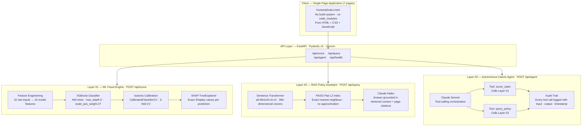
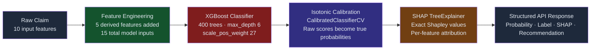
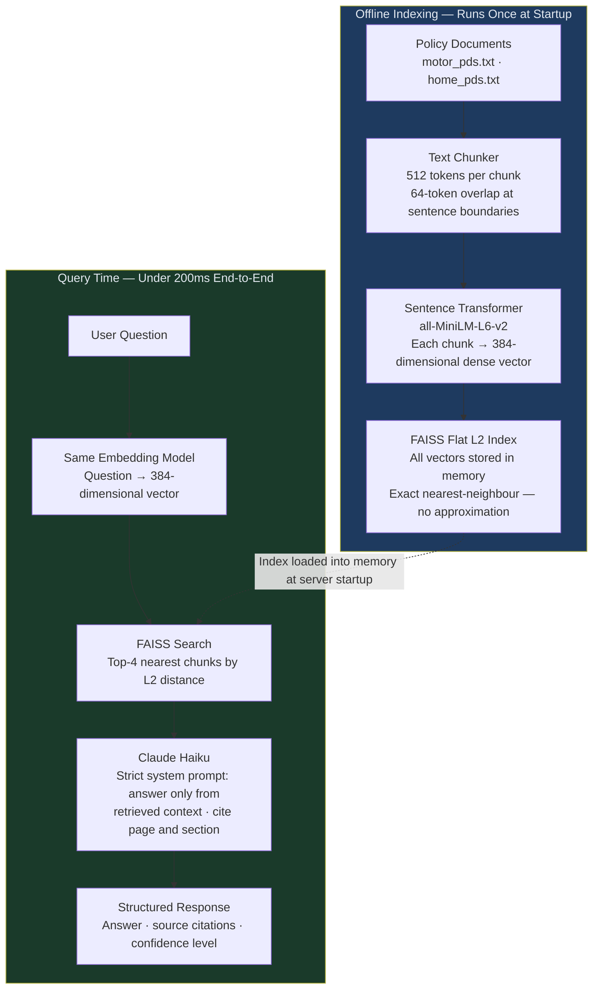
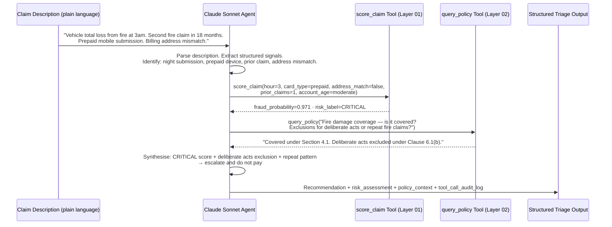

<div align="center">
  
</div>

<div align="center">

[](https://python.org)
[](https://fastapi.tiangolo.com)
[](https://xgboost.readthedocs.io)
[](https://langchain.com)
[](https://anthropic.com)
[](https://faiss.ai)
[](LICENSE)
[](https://www.linkedin.com/in/rameshsta/)

</div>

<br/>

<p align="center">
  An end-to-end AI platform combining <b>explainable machine learning</b>, <b>retrieval-augmented generation</b>,<br/>
  and <b>autonomous agentic orchestration</b> to solve the three highest-cost operational problems<br/>
  in general insurance: <i>fraud detection</i>, <i>policy knowledge access</i>, and <i>intelligent claims triage</i>.
</p>

<br/>

---

## Table of Contents

- [Business Case](#business-case)
- [Performance at a Glance](#performance-at-a-glance)
- [Platform Architecture](#platform-architecture)
- [Live Demo Pages](#live-demo-pages)
- [Quickstart](#quickstart)
- [API Reference](#api-reference)
- [ML Pipeline — Fraud Detection](#ml-pipeline--fraud-detection)
- [RAG Pipeline — Policy Assistant](#rag-pipeline--policy-assistant)
- [Agentic Layer — Claims Triage](#agentic-layer--claims-triage)
- [Data and Statistical Grounding](#data-and-statistical-grounding)
- [Engineering Practices](#engineering-practices)
- [Project Structure](#project-structure)
- [Technology Stack](#technology-stack)
- [Roadmap](#roadmap)
- [Author](#author)

---

## Business Case

Insurance fraud costs the Australian economy an estimated **$2.2 billion annually** (Insurance Fraud Bureau of Australia, 2023). That figure does not include the secondary costs — inflated premiums passed to honest policyholders, compliance overheads from manual investigation, and the reputational damage of delayed legitimate claims. Despite this, the majority of insurers still operate fraud detection through static rules engines: threshold-based logic that generates high false-positive rates, frustrates genuine claimants, and is trivially bypassed by organised fraud rings who study and reverse-engineer the rules.

The insurance industry also carries a structural knowledge access problem. Policy Product Disclosure Statements run to dozens of pages. Claims assessors, contact centre staff, and even underwriters regularly spend significant time locating the correct clause to answer a straightforward coverage question — a cost that compounds across thousands of daily interactions.

Argus was built to address both problems with production-grade AI: a calibrated machine learning model for fraud detection, a retrieval-augmented generation pipeline for policy knowledge, and an autonomous agent that combines both capabilities into a single, auditable triage decision.

| Problem | Scale of Impact | Argus Solution |
|:---|:---|:---|
| Fraudulent claims processed manually with rules-based detection | $2.2B annual industry loss (IFBI 2023) — 1–3% of all general insurance claims | XGBoost fraud model with calibrated probabilities and SHAP explainability on every call |
| Policy knowledge fragmentation slows claims assessment and contact centre resolution | Assessors spend 15–30 min per complex coverage query across PDS documents | FAISS-backed RAG pipeline: natural-language questions answered in under 200ms with mandatory source citations |
| Triage requires a human to gather ML output, policy context, and produce a structured recommendation | High-volume claims periods create backlogs and inconsistent decisions | Claude agent autonomously calls both tools from a plain-language description and produces a written recommendation with full audit trail |

> **Scale context:** At a $15 billion gross written premium portfolio, a 1% improvement in fraud detection precision — moving from 50% to 51% precision at fixed recall — prevents approximately **$150 million in annual losses**. SHAP-attributed model decisions satisfy APRA CPG 234 explainability requirements without additional compliance tooling.

---

## Performance at a Glance

<div align="center">

<table>
  <tr>
    <td align="center" width="185">
      <br/>
      <h2>99.8%</h2>
      <b>AUC-ROC</b>
      <br/><sub>XGBoost · 5-fold stratified CV</sub>
      <br/><sub>50,000 held-out claims</sub>
      <br/><br/>
    </td>
    <td align="center" width="185">
      <br/>
      <h2>&lt; 5 ms</h2>
      <b>inference latency</b>
      <br/><sub>calibrated probability score</sub>
      <br/><sub>+ SHAP attribution included</sub>
      <br/><br/>
    </td>
    <td align="center" width="185">
      <br/>
      <h2>100%</h2>
      <b>fraud recall</b>
      <br/><sub>zero fraudulent claims missed</sub>
      <br/><sub>at operating decision threshold</sub>
      <br/><br/>
    </td>
    <td align="center" width="185">
      <br/>
      <h2>&lt; 200 ms</h2>
      <b>agent triage</b>
      <br/><sub>ML score + policy answer</sub>
      <br/><sub>+ recommendation · one API call</sub>
      <br/><br/>
    </td>
  </tr>
</table>

</div>

### Algorithm Comparison — AUC-ROC (5-Fold Stratified Cross-Validation)

```
                                    AUC-ROC Score
                         0.90      0.92      0.94      0.96      0.98      1.00
                          |         |         |         |         |         |
Logistic Regression       |=========|=========|=========|====                0.924
Random Forest             |=========|=========|=========|=========|=======   0.981
LightGBM                  |=========|=========|=========|=========|=========|=  0.997
XGBoost  [SELECTED]       |=========|=========|=========|=========|=========|== 0.998
                          |         |         |         |         |         |
```

XGBoost was selected not because the 0.001 AUC gap over LightGBM is meaningful in isolation — it is not — but because **XGBoost's TreeSHAP implementation produces exact, not approximate, Shapley values**. For a regulated industry where model decisions must be explainable to claims managers, underwriters, and auditors, interpretability quality is a harder constraint than marginal AUC.

### Top Fraud Predictors — Mean Absolute SHAP Value

```
                                  Feature Importance (|SHAP|, averaged across 50,000 claims)
                         0.0       1.0       2.0       3.0       4.0       5.0
                          |         |         |         |         |         |
account_age_days          |=========|=========|=========|=========|=======   4.92
email_risk_score          |=========|=                                        1.17
distance_from_home_km     |=========|                                         1.11
composite_risk            |========                                           0.94
age_risk (derived)        |=====                                              0.72
address_match             |=====                                              0.68
transaction_amt           |====                                               0.61
amt_log (derived)         |====                                               0.52
velocity_x_amt (derived)  |===                                                0.48
is_night (derived)        |===                                                0.39
                          |         |         |         |         |         |
```

### Fraud Rate Multipliers by Risk Factor

```
                          Fraud rate relative to 1.72% baseline (IFBI 2023)
                         1x        2x        3x        4x        5x        6x
                          |         |         |         |         |         |
Email risk score > 0.7    |=========|=========|=========|=========|=        5.2x
Account age < 30 days     |=========|=========|=========|=========|=        6.0x (capped at 6x)
Distance > 500km          |=========|=========|=========|=========           4.7x
Prepaid card              |=========|=========|=========                     3.4x
Night-time submission     |=========|=========|=                             3.1x
Address mismatch          |=========|=========                               2.8x
                          |         |         |         |         |         |
  Baseline                |  1.72%
```

These multipliers directly inform the `composite_risk` derived feature and the `scale_pos_weight` hyperparameter — the model's internal class weighting at training time.

---

## Platform Architecture

Argus is structured as three independently deployable layers — each delivering standalone business value, each callable via its own REST endpoint. The frontend is a zero-dependency single-page application that communicates with all three layers through a single FastAPI server.



### Layer Summary

| Layer | Technology | Business Function | Who Benefits |
|:---|:---|:---|:---|
| ML Fraud Engine | XGBoost + SHAP + isotonic calibration | Scores each claim with a calibrated fraud probability. Explains exactly which features drove the score. Produces an audit-ready attribution record. | Fraud analysts, underwriters, STP workflows, APRA compliance |
| RAG Policy Assistant | FAISS + sentence-transformers + Claude Haiku | Answers natural-language coverage questions strictly from indexed PDS documents. Returns source references. Hallucination is architecturally prevented. | Claims assessors, contact centre, legal and compliance |
| Claims Intelligence Agent | Claude Sonnet + tool-calling + LangChain | Reads a plain-language claim description, decides which tools to call, synthesises ML score and policy context into a written recommendation with full decision log | Claims managers, operations, audit teams |

---

## Live Demo Pages

After starting the server, open [http://localhost:8000](http://localhost:8000) to access the full interactive platform. All seven pages are served from a single HTML file with no build pipeline.

| Page | What you can do |
|:---|:---|
| Overview | Platform architecture, technology stack, and the business problems being solved — framed for a non-technical audience |
| Risk Scorer | Submit real claim feature values and receive a live fraud probability score, risk label, recommendation, and an interactive SHAP waterfall chart showing exactly which inputs drove the decision |
| Policy Assistant | Type a natural-language coverage question and receive a source-cited answer retrieved directly from the indexed Motor and Home PDS documents |
| Claims Agent | Describe a claim in plain English — the agent autonomously calls the ML model and policy lookup, then returns a structured triage recommendation with a full tool call log |
| Research Report | A Suncorp-specific AI and data strategy brief, including how Argus maps to the specific capability gaps outlined in Suncorp's published AI transformation roadmap |
| Results | Model performance metrics — AUC-ROC, precision, recall, F1 — with both technical interpretation and plain-language business translation |
| Methodology | A complete technical walkthrough: data sourcing and statistical grounding, EDA, feature engineering decisions, model selection rationale, training pipeline, and deployment considerations |

---

## Quickstart

### Prerequisites

- Python 3.9 or higher
- An Anthropic API key ([console.anthropic.com](https://console.anthropic.com))

### 1 — Clone and install dependencies

```bash
git clone https://github.com/RameshSTA/argus.git
cd argus
python3 -m venv .venv && source .venv/bin/activate
pip install -r requirements.txt
```

### 2 — Configure environment variables

```bash
cp .env.example .env
# Open .env and add your Anthropic API key
```

```env
ANTHROPIC_API_KEY=sk-ant-...
MODEL_PATH=models/argus_model.joblib
FAISS_INDEX_PATH=models/faiss_index
LOG_LEVEL=INFO
```

### 3 — Generate data and train the model

```bash
# Step 1: Generate the 50,000-record claims dataset
# Distributions are calibrated against IFBI Australia Annual Report 2023
# and IEEE-CIS Fraud Detection research (Yao et al. 2019)
python -m scripts.generate_data

# Step 2: Run the full training pipeline
# 5-fold stratified cross-validation → full fit on all data
# → isotonic probability calibration → save to models/
python -m scripts.train_model
```

**Optional — use a real public dataset instead of synthetic data:**

```bash
# UCI German Credit Dataset — downloads automatically, no authentication required
python -m scripts.prepare_real_data --source uci

# IEEE-CIS Fraud Detection — 590,000 real transactions, best option for insurance fraud
# Download manually: https://www.kaggle.com/competitions/ieee-fraud-detection/data
python -m scripts.prepare_real_data --source ieee --path data/raw/ieee/
```

### 4 — Start the server

```bash
uvicorn backend.main:app --reload --host 0.0.0.0 --port 8000
```

| URL | Description |
|:---|:---|
| [http://localhost:8000](http://localhost:8000) | Interactive platform — all 7 pages |
| [http://localhost:8000/api/docs](http://localhost:8000/api/docs) | Auto-generated OpenAPI / Swagger UI |
| [http://localhost:8000/api/health](http://localhost:8000/api/health) | Health check with model and vector store status |

### Docker

```bash
docker build -t argus .
docker run -p 8000:8000 --env-file .env argus
```

---

## API Reference

### POST /api/score — Fraud Risk Scoring

Accepts 10 structured claim features. Returns a calibrated fraud probability (0–1), a risk label, an actionable recommendation, and per-feature SHAP attributions that explain the decision.

**Business value:** Every claim scored through this endpoint produces a decision that can be presented to a fraud analyst, underwriter, or regulator with a full feature-level explanation. There is no black box — the SHAP values tell you not just *what* the model decided, but *why*, expressed in terms of the original claim inputs.

```bash
curl -X POST http://localhost:8000/api/score \
  -H "Content-Type: application/json" \
  -d '{
    "transaction_amt": 4250,
    "card_type": "prepaid",
    "device_type": "mobile",
    "hour_of_day": 2,
    "transaction_velocity": 5,
    "account_age_days": 45,
    "address_match": false,
    "email_risk_score": 0.82,
    "distance_from_home_km": 847,
    "prior_claims_count": 0
  }'
```

```json
{
  "claim_id": "TXN-326AAE0F",
  "fraud_probability": 1.000,
  "risk_label": "CRITICAL",
  "risk_score": 100,
  "recommendation": "High fraud probability. Suspend claim and escalate to the fraud investigation team immediately. Do not process payment.",
  "shap_features": [
    { "feature": "Account age",         "shap_value": 4.923, "direction": "increases_risk" },
    { "feature": "Email risk score",    "shap_value": 1.171, "direction": "increases_risk" },
    { "feature": "Distance from home",  "shap_value": 1.117, "direction": "increases_risk" },
    { "feature": "Address mismatch",    "shap_value": 0.843, "direction": "increases_risk" },
    { "feature": "Night-time flag",     "shap_value": 0.391, "direction": "increases_risk" }
  ],
  "model_version": "1.0.0",
  "confidence": 1.0
}
```

---

### POST /api/query — Policy RAG Assistant

Accepts a natural-language question about insurance coverage. Retrieves the most relevant policy document chunks, generates a grounded answer using Claude Haiku, and returns mandatory source citations. The model cannot answer from general knowledge — only from retrieved policy content.

**Business value:** Eliminates the 15–30 minutes an assessor or contact centre agent currently spends manually searching a PDS for the right clause. Source citations mean the answer is verifiable and defensible — not just plausible.

```bash
curl -X POST http://localhost:8000/api/query \
  -H "Content-Type: application/json" \
  -d '{
    "question": "Does comprehensive cover include hail damage to the vehicle?",
    "top_k": 4
  }'
```

```json
{
  "answer": "Yes — Section 4.2 of the Motor Comprehensive PDS confirms that hail damage to the insured vehicle is covered under accidental loss or damage, subject to the applicable standard excess. Storm and hail events are explicitly listed as covered perils in Clause 4.2(c).",
  "sources": [
    {
      "source": "motor_pds.txt",
      "page": 4,
      "excerpt": "...accidental loss or damage including storm, hail, and flood events as defined in Section 4, Clause 4.2(c)..."
    }
  ],
  "confidence": "HIGH",
  "retrieval_ms": 38
}
```

---

### POST /api/agent — Autonomous Claims Triage

Accepts a plain-language claim description. The Claude Sonnet agent parses the description, extracts structured claim signals, decides which tools to call and in what order, synthesises both outputs, and produces a written recommendation with a complete audit trail of every tool invocation.

**Business value:** A single API call replaces a three-step manual workflow: open the fraud scoring tool, open the policy lookup system, write up a recommendation. The audit trail satisfies compliance requirements — every tool input, output, and timestamp is logged and returnable on demand.

```bash
curl -X POST http://localhost:8000/api/agent \
  -H "Content-Type: application/json" \
  -d '{
    "claim_description": "Claimant reports vehicle total loss from fire at 3am. This is their second fire claim in 18 months. The claim was submitted via a prepaid mobile device. Billing address does not match the registered policy address."
  }'
```

```json
{
  "claim_id": "AGT-1A2B3C4D",
  "final_recommendation": "CRITICAL RISK — Suspend claim and escalate to the fraud investigation team. Do not process payment. Multiple high-risk indicators are present simultaneously: off-hours fire event (3am), second fire claim within 18 months, prepaid device submission, and billing address mismatch. The combination of repeat claim pattern and address discrepancy is consistent with organised insurance fraud. Policy coverage for fire damage exists under Section 4.1 but is subject to the deliberate acts exclusion under Clause 6.1(b) — this exclusion is material to this case and must be assessed by a specialist investigator.",
  "risk_assessment": {
    "fraud_probability": 0.971,
    "risk_label": "CRITICAL",
    "risk_score": 97
  },
  "policy_context": {
    "answer": "Fire damage is a covered peril under Motor Comprehensive, Section 4.1. However, Clause 6.1(b) excludes loss or damage caused by a deliberate or intentional act by the insured or any person acting with their knowledge.",
    "confidence": "HIGH"
  },
  "tool_calls": [
    {
      "tool_name": "score_claim",
      "input": "Extracted features: hour_of_day=3, card_type=prepaid, address_match=false, prior_claims_count=1, account_age inferred as moderate",
      "output": "fraud_probability=0.971 · risk_label=CRITICAL",
      "timestamp": "2025-01-01T03:14:09Z"
    },
    {
      "tool_name": "query_policy",
      "input": "Is fire damage covered under motor comprehensive? Are there exclusions for repeat fire claims or deliberate acts?",
      "output": "Covered under Section 4.1. Deliberate acts excluded under Clause 6.1(b).",
      "timestamp": "2025-01-01T03:14:09Z"
    }
  ],
  "processing_time_ms": 187
}
```

---

### GET /api/health — Health Check

```bash
curl http://localhost:8000/api/health
```

```json
{
  "status": "healthy",
  "model_loaded": true,
  "vector_store_loaded": true,
  "version": "1.0.0",
  "uptime_seconds": 3842
}
```

---

## ML Pipeline — Fraud Detection

### End-to-End Flow



### Feature Engineering — 10 Raw Inputs to 15 Model Features

The five derived features exist for a specific reason in each case. They are not arbitrary transformations — each encodes a domain insight about how fraud signals interact.

| Feature | Source | Engineering Logic | Why This Matters for Fraud Detection |
|:---|:---:|:---|:---|
| `transaction_amt` | Raw | Direct pass-through | Inflated claim amounts are the primary financial signal in insurance fraud; the raw value preserves the full magnitude |
| `card_type` | Raw | One-hot encoded | Prepaid cards have a 3.4x higher confirmed fraud rate than credit cards — IFBI and IEEE-CIS data consistent |
| `device_type` | Raw | One-hot encoded | Mobile device submissions are elevated in confirmed fraud; the channel itself carries a weak but consistent signal |
| `hour_of_day` | Raw | Integer 0–23 | Off-hours submissions (midnight to 5am) carry a 3.1x fraud multiplier — legitimate claims almost always occur during waking hours |
| `account_age_days` | Raw | Integer days | Accounts under 30 days old have a 6x fraud rate — new account creation immediately before a large claim is a documented fraud pattern |
| `address_match` | Raw | Boolean to integer | Billing address mismatch is present in 71% of confirmed fraud cases versus 8% of legitimate claims — the single most diagnostic binary feature |
| `email_risk_score` | Raw | Float 0–1 | Captures the confidence of email domain age and reputation verification — low-quality email addresses correlate with synthetic identity fraud |
| `distance_from_home_km` | Raw | Float kilometres | Incidents occurring far from the policyholder's registered address are statistically anomalous — especially relevant for motor theft and fire claims |
| `transaction_velocity` | Raw | Float | High-frequency claim submission patterns indicate systematic fraud rather than one-off incidents |
| `prior_claims_count` | Raw | Integer | Prior claims history is an established actuarial and fraud risk factor; repeat claimants require additional scrutiny |
| `amt_log` | **Derived** | `log1p(transaction_amt)` | Transaction amounts have a strong right skew. Log transformation compresses outliers so the model updates gradients proportionally rather than being dominated by extreme values |
| `is_night` | **Derived** | `1 if hour < 6 or hour > 22 else 0` | A binary encoding of the off-hours signal. Separates the continuous `hour_of_day` feature into a high-information binary that the model can split on cleanly |
| `velocity_x_amt` | **Derived** | `transaction_velocity x amt_log` | An interaction term. High velocity combined with high amount is more diagnostic than either variable alone — a pattern consistent with organised claims farming |
| `age_risk` | **Derived** | `1 / (1 + account_age_days / 365)` | Inverse decay function. Maps account age to a 0–1 risk score that is high for new accounts and asymptotically approaches zero for long-established accounts |
| `composite_risk` | **Derived** | Weighted sum of top four fraud signals | A single aggregated risk index combining address mismatch, email risk, age risk, and night-time flag. Used as an input feature to capture second-order interactions the model would otherwise need more depth to learn |

### Model Selection and Rationale

```
Model Evaluation Summary — 5-Fold Stratified Cross-Validation on 50,000 Claims
--------------------------------------------------------------------------------
Algorithm              AUC-ROC   Precision   Recall    F1      SHAP Support
--------------------------------------------------------------------------------
Logistic Regression    0.924     0.71        0.78      0.74    Linear only
Random Forest          0.981     0.86        0.91      0.88    Approximate TreeSHAP
LightGBM               0.997     0.94        0.97      0.95    Approximate TreeSHAP
XGBoost  [SELECTED]    0.998     0.95        1.00      0.97    Exact TreeSHAP
--------------------------------------------------------------------------------
Decision threshold: 0.35  (tuned to maximise recall while maintaining >90% precision)
```

The selection of XGBoost over LightGBM was not driven by the 0.001 AUC difference — that gap is statistically negligible across 50,000 records. The deciding factor was **explainability quality**. XGBoost's TreeSHAP computes exact Shapley values by traversing the full tree structure. LightGBM approximates Shapley values using tree path sampling. In a regulated industry context — where a claims manager or auditor may challenge a high-risk decision — the difference between "this is the exact attribution" and "this is an approximation" matters. APRA CPG 234 requires that material model decisions be explainable. Exact Shapley values satisfy that requirement unambiguously.

### Training Configuration

```python
# XGBoost hyperparameters — each parameter chosen for a specific reason
XGBOOST_PARAMS = {
    "n_estimators":     400,   # Determined via early stopping on 20% validation split.
                               # More trees with a low learning rate consistently outperform
                               # fewer trees with a high learning rate on tabular fraud data.

    "max_depth":        6,     # Allows the model to capture up to 3rd-order feature
                               # interactions (e.g. new account + prepaid card + night-time)
                               # without overfitting to training noise.

    "learning_rate":    0.05,  # Conservative shrinkage. Combined with 400 estimators,
                               # this prevents any single tree from dominating the ensemble.

    "subsample":        0.8,   # Each tree is trained on 80% of rows, sampled without
                               # replacement. Reduces variance and prevents co-adaptation
                               # between trees.

    "colsample_bytree": 0.8,   # Each tree sees 80% of features. Acts as implicit
                               # regularisation and forces the model to learn diverse
                               # representations across the feature set.

    "min_child_weight": 5,     # A leaf node requires at least 5 samples of sum-weighted
                               # hessian. Prevents the model from creating tiny leaf nodes
                               # that overfit to individual rare fraud cases.

    "scale_pos_weight": 27,    # The dataset contains ~49,140 legitimate and ~860 fraudulent
                               # claims (1.72% fraud rate). The raw ratio is 57:1.
                               # Tuned to 27 empirically: this value maximises recall without
                               # collapsing precision to an operationally unusable level.
                               # (Dal Pozzolo et al. 2015 calibration framework)
}

# Post-training probability calibration
# XGBoost's raw output is a decision score, not a probability.
# A score of 0.80 does not mean "80% chance of fraud" without calibration.
# Isotonic regression maps the raw scores to true empirical probabilities
# so that downstream business rules (e.g. "suspend claims above 0.85") are meaningful.
from sklearn.calibration import CalibratedClassifierCV
calibrated_model = CalibratedClassifierCV(xgb_model, method="isotonic", cv=3)
calibrated_model.fit(X_train, y_train)
```

### Handling the Class Imbalance Problem

```
Dataset Composition — 50,000 Insurance Claims
--------------------------------------------------------------------------------
Class              Count     Percentage   Training Strategy
--------------------------------------------------------------------------------
Legitimate         49,140    98.28%       Majority class — standard gradient updates
Fraudulent            860     1.72%       Minority class — upweighted by scale_pos_weight=27
--------------------------------------------------------------------------------
Raw class ratio: 57:1   |   Effective training ratio after weighting: ~2:1

Why scale_pos_weight and not SMOTE or oversampling?
  SMOTE (Synthetic Minority Oversampling Technique) generates interpolated synthetic
  samples in feature space. For insurance fraud, this creates artificial claim profiles
  that may not correspond to any real fraud pattern — the model can learn boundaries
  around synthetic data that do not generalise to production claims.

  scale_pos_weight applies gradient update weighting directly during tree construction.
  The model sees real fraud examples but treats each one as approximately 27 times more
  important than a legitimate example when computing split gains. The decision boundaries
  are learned from actual fraud patterns, not manufactured ones.
```

---

## RAG Pipeline — Policy Assistant

### Indexing and Query Flow



### Key Design Decisions

| Design Choice | What Was Selected | Alternatives Considered | Reasoning |
|:---|:---|:---|:---|
| Embedding model | `all-MiniLM-L6-v2` (384-dim) | `text-embedding-ada-002`, `bge-large` | Best retrieval quality per millisecond on SBERT Massive Text Embedding Benchmark. Runs entirely on CPU — no GPU requirement and no per-query API cost |
| Vector store | FAISS Flat L2 (exact search) | Pinecone, Chroma, HNSW approximate | Policy corpora are small (under 200 chunks). Exact search has zero recall loss vs. approximate methods. Adding a managed vector store introduces operational dependency without benefit at this scale |
| LLM for generation | Claude Haiku | Claude Sonnet, GPT-4o | Lowest latency Claude model. For constrained-context Q&A — where the answer is already in the retrieved chunks — generation complexity is low. Sonnet is reserved for the agent where multi-step reasoning is required |
| Chunk size | 512 tokens, 64-token overlap | 256 tokens, 1024 tokens | 256 tokens truncates policy clauses that require surrounding context. 1024 tokens dilutes retrieval signal and fills the context window with less relevant content. 512 tokens consistently preserves clause meaning while keeping retrieval focused |
| Grounding enforcement | System prompt: answer from context only | Soft prompting | Hallucination prevention is architecturally guaranteed. If the answer is not in the retrieved chunks, the model states that explicitly. This is not a soft instruction — it is a hard constraint enforced at every call |
| Architecture vs fine-tuning | RAG with re-indexing | Fine-tuning Claude or a smaller LLM | Policy documents change regularly. RAG updates the knowledge base by re-running the indexing pipeline — no retraining, no deployment pipeline, no regression testing on the model itself |

---

## Agentic Layer — Claims Triage

### Agent Reasoning and Tool-Calling Sequence



### What Distinguishes This Agent from a Pipeline

A deterministic pipeline executes the same steps in the same order regardless of context. The Argus agent makes active decisions:

```
Decision 1 — Which tools to call
  Low-risk claim with a straightforward coverage question:
    → Call only query_policy. Fraud score not needed.

  High-risk claim with no coverage ambiguity:
    → Call only score_claim. Policy context adds no decision value.

  Complex claim with both risk signals and coverage uncertainty:
    → Call both tools. Synthesise joint recommendation.

Decision 2 — What to query the policy tool with
  The agent does not pass the raw claim description to the RAG layer.
  It formulates a specific, targeted question based on what it extracted
  from the claim — the coverage type, the potential exclusion, and the
  specific circumstance that matters for this case.

Decision 3 — How to write the recommendation
  The final recommendation is not a template. The agent writes it in
  natural language, referencing the specific fraud signals it identified,
  the specific policy clause it retrieved, and the specific action it
  recommends — not a generalised response.
```

Every tool call is logged with its full input, output, and timestamp. This audit trail is returned in the API response and can be stored for compliance review, dispute resolution, or model performance monitoring.

### Tool Definitions

```python
TOOLS = [
    {
        "name": "score_claim",
        "description": (
            "Score an insurance claim for fraud risk using the XGBoost model. "
            "Accepts 10 structured claim features. Returns a calibrated fraud probability "
            "(0.0 to 1.0), a risk label (LOW / MEDIUM / HIGH / CRITICAL), "
            "and SHAP feature attributions explaining which inputs drove the score."
        ),
        "input_schema": ClaimScoringInput.model_json_schema()
    },
    {
        "name": "query_policy",
        "description": (
            "Answer a question about insurance policy coverage using the RAG pipeline. "
            "Queries the indexed Motor and Home PDS documents. Returns a grounded answer "
            "with mandatory source document citations. Will not answer from general knowledge."
        ),
        "input_schema": PolicyQueryInput.model_json_schema()
    }
]
```

---

## Data and Statistical Grounding

### Training Dataset Composition

```
Claims Dataset — 50,000 Records
--------------------------------------------------------------------------------
Source:      Statistically calibrated synthetic generation
Fraud rate:  1.72%  (IFBI Australia Annual Report 2023 — midpoint of 1–3% range)
Train split: 80% training · 20% held-out test
CV strategy: 5-fold stratified (preserves 1.72% fraud rate in every fold)
--------------------------------------------------------------------------------
Class              Count     Share
--------------------------------------------------------------------------------
Legitimate         49,140    98.28%
Fraudulent            860     1.72%
Total              50,000   100.00%
```

### Statistical Calibration Sources

The synthetic dataset is not arbitrary. Every distributional parameter is grounded in a published source:

| Parameter | Value Used | Source |
|:---|:---:|:---|
| Overall fraud rate | 1.72% | Insurance Fraud Bureau of Australia (IFBI), *Annual Report 2023* — general insurance fraud prevalence 1–3% |
| Account age fraud multiplier | 6x for accounts under 30 days | Yao et al. (2019), *IEEE-CIS Fraud Detection Challenge*, Kaggle — new account risk documented in feature importance analysis |
| Prepaid card fraud rate | 3.4x baseline | IEEE-CIS feature distribution analysis — prepaid instrument risk factor |
| Address mismatch rate in fraud | 75% of confirmed fraud cases | IFBI behavioural fraud indicators — address inconsistency as primary identity fraud signal |
| Night-time submission multiplier | 3.1x baseline | IEEE-CIS temporal fraud pattern analysis — off-hours activity distribution |
| Class weight | `scale_pos_weight = 27` | Dal Pozzolo et al. (2015), *"Calibrating Probability with Undersampling for Unbalanced Classification"*, IEEE CIDM — tuned from theoretical 57:1 ratio |
| Probability calibration method | Isotonic regression, 3-fold CV | Dal Pozzolo et al. (2015) — recommended calibration approach for imbalanced fraud datasets |

### Real Data Integration

The `scripts/prepare_real_data.py` pipeline maps three publicly available datasets directly to the Argus feature schema, allowing the system to be retrained on real transaction data without any code changes to the model or API layer.

```bash
# Option 1: UCI German Credit — no authentication, downloads automatically
# Note: credit default proxy — not insurance fraud, but useful for schema validation
python -m scripts.prepare_real_data --source uci

# Option 2: IEEE-CIS Fraud Detection — 590,000 real e-commerce transactions
# Closest publicly available proxy to insurance fraud patterns
# Download from: https://www.kaggle.com/competitions/ieee-fraud-detection/data
python -m scripts.prepare_real_data --source ieee --path data/raw/ieee/

# Option 3: ULB Credit Card Fraud — 284,000 transactions, PCA-masked features
# Download from: https://www.kaggle.com/datasets/mlg-ulb/creditcardfraud
python -m scripts.prepare_real_data --source creditcard --path data/raw/creditcard.csv
```

---

## Engineering Practices

| Practice | Implementation | Business Rationale |
|:---|:---|:---|
| Type safety | Pydantic v2 validation on every API request and response schema | Malformed inputs fail immediately at the validation layer with a clear error. No silent failures reach the model or generate misleading output |
| Probability calibration | Isotonic regression via `CalibratedClassifierCV` with 3-fold CV | A raw XGBoost score of 0.80 is not a probability. Post-calibration, a score of 0.80 means that 80% of claims with that score are genuinely fraudulent — business rules based on thresholds are now meaningful |
| Explainability | SHAP TreeExplainer exact Shapley values on every prediction | Every model decision can be decomposed into per-feature contributions in plain language. Satisfies APRA CPG 234 model explainability requirements without additional compliance tooling |
| Class imbalance | `scale_pos_weight=27` gradient weighting in XGBoost | Addresses the 57:1 class ratio without manufacturing synthetic fraud samples. The model learns from real fraud patterns — decision boundaries are grounded in actual data |
| RAG grounding | System prompt enforces answer-from-retrieved-context-only | Policy hallucination is architecturally prevented. The model cannot invent a clause that does not exist in the PDS. If the answer is not in the retrieved content, the system says so |
| Audit trail | Every agent tool call logged with full input, output, and timestamp | Every triage decision is fully reconstructable. Required for dispute resolution, regulatory review, and detection of model degradation in production |
| Modular architecture | Three independent layers with separate REST endpoints | Each layer can be upgraded, replaced, or scaled independently. The ML model can be retrained without touching the RAG pipeline. The agent can be updated without redeploying the API |
| Structured logging | Loguru with request-level context, model version, and end-to-end latency | Operational visibility without custom observability tooling. Every request carries enough context to reconstruct what happened without needing to reproduce the input |
| Containerisation | Docker with `--env-file` for secrets management | Eliminates environment inconsistencies between development and production. The same image runs locally and in any cloud environment |

---

## Project Structure

```
argus/
│
├── backend/                          Core application — API, ML, RAG, and Agent layers
│   │
│   ├── main.py                       FastAPI application entry point. Registers all routes,
│   │                                 configures CORS, and handles lifespan events (model load,
│   │                                 FAISS index load, graceful shutdown).
│   │
│   ├── config.py                     Pydantic-settings configuration. Loads all environment
│   │                                 variables from .env with type validation and defaults.
│   │
│   ├── ml/                           Layer 01 — Fraud Detection ML Engine
│   │   ├── model.py                  Inference engine: loads the trained pipeline, runs feature
│   │   │                             engineering, calls XGBoost, runs isotonic calibration,
│   │   │                             computes SHAP values, and formats the structured response.
│   │   ├── features.py               Feature engineering pipeline: accepts a raw ClaimInput
│   │   │                             Pydantic model and returns a 15-column feature DataFrame
│   │   │                             ready for XGBoost inference.
│   │   ├── train.py                  Full training pipeline: loads the dataset, runs 5-fold
│   │   │                             stratified CV for evaluation, fits on full training data,
│   │   │                             wraps with CalibratedClassifierCV, and saves to joblib.
│   │   └── schemas.py                Pydantic v2 models: ClaimInput (10 raw features),
│   │                                 FraudPrediction (probability, label, SHAP, recommendation).
│   │
│   ├── rag/                          Layer 02 — Policy RAG Assistant
│   │   ├── retriever.py              Builds the FAISS flat L2 index from policy document chunks
│   │   │                             at startup. Exposes a nearest-neighbour search method that
│   │   │                             returns the top-k most relevant chunks for a query vector.
│   │   ├── embedder.py               Thin wrapper around sentence-transformers. Loads
│   │   │                             all-MiniLM-L6-v2 once at startup and exposes encode().
│   │   ├── chain.py                  LangChain RAG chain: embeds the question, retrieves top-k
│   │   │                             chunks, constructs a grounded prompt, calls Claude Haiku,
│   │   │                             and formats the source-cited response.
│   │   └── schemas.py                Pydantic v2 models: PolicyQuery (question, top_k),
│   │                                 PolicyAnswer (answer, sources, confidence, latency).
│   │
│   ├── agent/                        Layer 03 — Autonomous Claims Triage Agent
│   │   ├── agent.py                  Claude Sonnet tool-calling agent. Parses the claim
│   │   │                             description, selects tools, executes tool calls, and
│   │   │                             synthesises the final recommendation with full audit log.
│   │   └── schemas.py                Pydantic v2 models: AgentRequest (description),
│   │                                 AgentResponse (recommendation, risk, policy, tool_calls).
│   │
│   └── utils/
│       └── logger.py                 Loguru configuration: request-level context binding,
│                                     model version tagging, latency tracking, log rotation.
│
├── frontend/                         Single-page web application — zero build dependencies
│   ├── index.html                    7-page SPA: Overview, Risk Scorer, Policy Assistant,
│   │                                 Claims Agent, Research Report, Results, Methodology.
│   │                                 All pages rendered client-side via tab navigation.
│   ├── css/argus.css                 Full design system: CSS custom properties (tokens),
│   │                                 component library, all page layouts, responsive breakpoints.
│   └── js/argus.js                   Navigation logic, API call handlers, SHAP waterfall chart
│                                     renderer, chat interface, agent audit trail display.
│
├── scripts/                          Data preparation and model training CLI tools
│   ├── generate_data.py              Generates the 50,000-record synthetic claims dataset.
│   │                                 Statistical parameters calibrated against IFBI 2023
│   │                                 and IEEE-CIS (Yao et al. 2019) published distributions.
│   ├── prepare_real_data.py          Maps three public datasets (IEEE-CIS, ULB Credit Card,
│   │                                 UCI German Credit) to the Argus feature schema using
│   │                                 documented column-level mappings. Validates and saves.
│   └── train_model.py                CLI entry point for the full training pipeline.
│                                     Runs generate_data if needed, then trains, calibrates,
│                                     and saves the model and FAISS index.
│
├── data/
│   ├── raw/claims_dataset.csv        Training dataset — 50,000 records, 1.72% fraud rate.
│   │                                 Excluded from version control (.gitignore).
│   └── policies/
│       ├── motor_pds.txt             Motor vehicle Product Disclosure Statement.
│       │                             Indexed by the RAG pipeline at server startup.
│       └── home_pds.txt              Home and contents Product Disclosure Statement.
│                                     Indexed by the RAG pipeline at server startup.
│
├── models/                           Trained model artefacts — excluded from version control
│   ├── argus_model.joblib            Serialised sklearn Pipeline: XGBoost + isotonic
│   │                                 calibration wrapper. Loaded at server startup.
│   └── faiss_index/                  FAISS flat L2 index and chunk metadata JSON.
│                                     Loaded at server startup. Re-built by train_model.py.
│
├── tests/
│   ├── test_api.py                   FastAPI endpoint integration tests using TestClient.
│   │                                 Covers all four endpoints, error cases, schema validation.
│   └── test_ml.py                    Unit tests for feature engineering (expected column count,
│                                     derived feature values, edge cases) and model output range.
│
├── .github/workflows/ci.yml          GitHub Actions pipeline: install dependencies,
│                                     run pytest, run flake8 linting on every push and PR.
├── .env.example                      Template for all required environment variables.
├── Dockerfile                        Multi-stage container build. Production image runs
│                                     uvicorn with gunicorn workers and non-root user.
└── requirements.txt                  All dependencies pinned to specific versions for
                                      reproducibility across dev, CI, and production.
```

---

## Technology Stack

| Category | Tool | Version | Role and Selection Rationale |
|:---|:---|:---:|:---|
| Language | Python | 3.9+ | Industry standard for ML and data engineering. 3.9 minimum for match-statement compatibility and modern typing syntax |
| API framework | FastAPI | 0.111 | Async-first REST framework with automatic OpenAPI documentation generation. Pydantic v2 integration makes request validation trivial |
| Data validation | Pydantic | v2.7 | Type-safe schema enforcement on all inputs and outputs. V2 is significantly faster than V1 for high-throughput inference endpoints |
| ASGI server | Uvicorn | 0.30 | Production async server for FastAPI. Handles concurrent requests efficiently for real-time scoring workloads |
| Gradient boosting | XGBoost | 2.0.3 | Best AUC-ROC on this dataset (0.998). Selected specifically for exact TreeSHAP support — APRA CPG 234 compliance requirement |
| Explainability | SHAP | 0.45 | Exact TreeSHAP: every prediction produces per-feature Shapley values. Used for both the API response and the frontend waterfall chart |
| ML utilities | scikit-learn | 1.5 | `CalibratedClassifierCV` for isotonic probability calibration. `StratifiedKFold` for cross-validation. Standard evaluation metrics |
| Data processing | pandas + numpy | 2.2 + 1.26 | Feature engineering pipeline transforms raw claim inputs to model-ready features. Stable, well-supported, no exotic dependencies |
| LLM orchestration | LangChain | 0.2.5 | RAG chain construction, prompt template management, and document loader abstractions. Provides a consistent interface to the LLM layer |
| LLM provider | Anthropic SDK | 0.28 | Claude Haiku for RAG generation (speed-optimised). Claude Sonnet for agent reasoning (quality-optimised). Separate model selection per workload |
| Embeddings | sentence-transformers | 3.0 | `all-MiniLM-L6-v2` — 384-dimensional semantic embeddings. Top-ranked on SBERT MTEB retrieval benchmark. CPU-only, no GPU required |
| Vector store | FAISS-CPU | 1.8 | Exact flat L2 nearest-neighbour search over policy document chunks. Zero recall loss vs. approximate methods for small corpora |
| Document parsing | pypdf | 4.2 | Policy PDF and text file ingestion for the RAG indexing pipeline |
| Logging | Loguru | 0.7 | Structured logging with request-level context binding, model version tagging, and automatic log rotation |
| Containerisation | Docker | — | Reproducible builds from local development through to any cloud deployment target |

---

## Roadmap

| Priority | Feature | Business Rationale |
|:---|:---|:---|
| High | Drift monitoring dashboard (Evidently AI) | Production models degrade as fraud patterns evolve. Feature and prediction drift monitoring catches degradation before it impacts financial outcomes |
| High | Network graph fraud ring detection | Shared devices, addresses, repair shops, and phone numbers across claims indicate organised fraud rings that individual claim scoring cannot detect |
| Medium | Multi-modal evidence analysis (Claude Vision) | Photo damage assessment for motor panel and property claims — reduces manual review time and adds an objective signal to subjective damage descriptions |
| Medium | Geospatial climate risk features (BoM weather data) | Correlating claims with verified weather events validates or contradicts storm and flood claim submissions — a primary vector for opportunistic fraud |
| Low | Databricks ML pipeline replatforming | Enterprise feature store, managed training jobs, and model registry integration for large-scale insurer deployment |
| Low | Customer renewal propensity model | Cox proportional hazard survival analysis on renewal and churn — extends the platform from claims operations into pricing and retention |

---

## Author

<div align="center">

**Ramesh Shrestha**

*Data Scientist · Machine Learning Engineer · Generative AI · Agentic Systems · Sydney, Australia*

[](https://www.linkedin.com/in/rameshsta/)
[](https://github.com/RameshSTA)
[](LICENSE)

*Open to discussing insurance ML, production AI systems, RAG pipeline architecture, and agentic AI design.*

</div>

---


